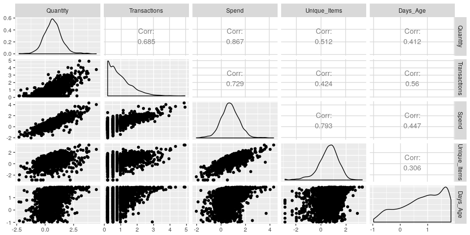
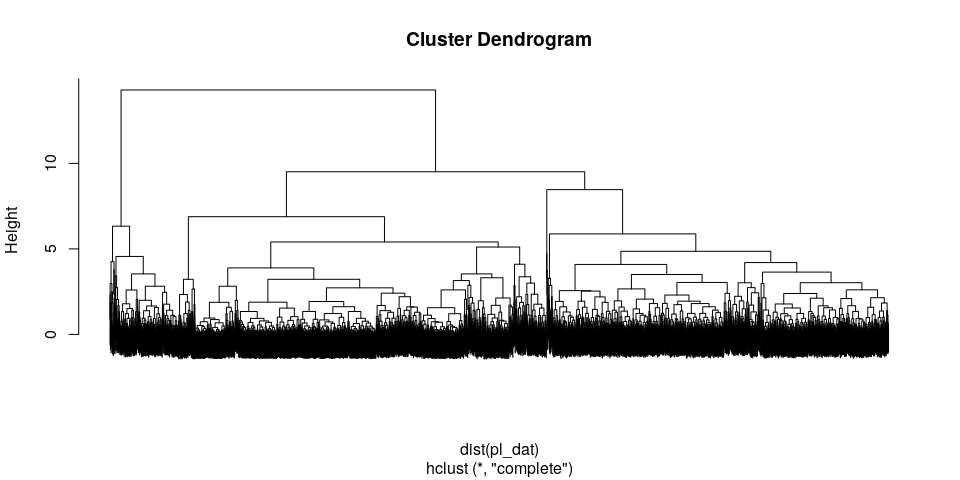

Clustering Customers for Segmentation
================
Chase Baggett

Introduction
============

I am going to be using clustering techniques to attempt customer segmentation on a dataset of purchasing data for an online retailer. Specifically, I am analyzing customer spending patterns and habits.

Data
====

Our data is actually per product. Since I am not very concerned at the moment with what people are buying, but rather what types of customers they are in terms of regularity and spend, I'm going to aggregate the data to the invoice level which greatly reduces the size of our data.

``` r
data <-
  summarise(
  group_by(eretail, CustomerID, Country),
  Quantity = sum(Quantity),
  Unique_Items = n_distinct(StockCode),
  Spend = sum(UnitPrice * Quantity),
  Transactions = n_distinct(InvoiceNo),
  Days_Age = as.numeric(difftime(max(InvoiceDate),min(InvoiceDate),units="days"))
  )
data <- data[complete.cases(data),]
```

I am going to prep a few different variables on this dataset.

| Field         | Description                                |
|---------------|--------------------------------------------|
| Spend         | Total Money Spent                          |
| Transactions  | Number of Invoices                         |
| Quantity      | Number of Products Purchased               |
| Unique\_Items | Number of Unique Items Purchased           |
| Days\_Age     | Number of Days From First to Last Purchase |

Analysis
========

A basic summary of our variables makes it apparent that there are a large number of customers who placed a very small numbers of orders, had a very low age, and few transactions. In fact, 35% of customers only had one transaction.

``` r
pl_dat <- data[,c("Quantity","Transactions","Spend","Unique_Items","Days_Age")]
summary(pl_dat)
```

    ##     Quantity       Transactions        Spend            Unique_Items    
    ##  Min.   :     1   Min.   :  1.00   Min.   :0.000e+00   Min.   :   1.00  
    ##  1st Qu.:   156   1st Qu.:  1.00   1st Qu.:8.636e+03   1st Qu.:  15.00  
    ##  Median :   367   Median :  2.00   Median :4.300e+04   Median :  34.00  
    ##  Mean   :  1139   Mean   :  4.13   Mean   :1.852e+06   Mean   :  60.04  
    ##  3rd Qu.:   950   3rd Qu.:  4.00   3rd Qu.:2.382e+05   3rd Qu.:  76.00  
    ##  Max.   :189533   Max.   :201.00   Max.   :1.920e+09   Max.   :1734.00  
    ##     Days_Age     
    ##  Min.   :  0.00  
    ##  1st Qu.:  0.00  
    ##  Median : 83.14  
    ##  Mean   :125.22  
    ##  3rd Qu.:245.05  
    ##  Max.   :364.05

Viewing the remaining 65%, I'm going to log transform and scale all variables except Days\_Age, which I will only scale. We have massively right tailed data and I am hoping that by using a log transformation the clusters we end up with will be logical.

``` r
log_zero <- function(x){ifelse(x==0,0,log(x))}
  
pl_dat$Quantity <- log_zero(pl_dat$Quantity)
pl_dat$Transactions <- log_zero(pl_dat$Transactions)
pl_dat$Spend <- log_zero(pl_dat$Spend)
pl_dat$Unique_Items <- log_zero(pl_dat$Unique_Items)
pl_dat <- as.data.frame(scale(pl_dat))
ggpairs(subset(pl_dat,Transactions>log(1)))
```



Hierarchical Clustering
-----------------------

First I perform a basic hierarchical clustering and look at the dendrogram to identify a cut point.

``` r
hc <- hclust(dist(pl_dat))
plot(hc,labels=FALSE)
```



Now I am going to cut the tree down to 5 clusters and store the classification.

We can take a look at a pairs plot of the scaled variables colored by classification.

``` r
pl_dat$hclust <- as.factor(cutree(hc,5))
ggpairs(pl_dat,mapping=aes(color=hclust))
```


K-Means Clustering
------------------

We will now use K-Means as well, using the 5 cluster we indentified using hierarchical clustering.

Below, we see the results on the K-Means on our scaled data.

``` r
pl_dat <- data[,c("Quantity","Transactions","Spend","Unique_Items","Days_Age")]


log_zero <- function(x){ifelse(x==0,0,log(x))}

pl_dat$Quantity <- log_zero(pl_dat$Quantity)
pl_dat$Transactions <- log_zero(pl_dat$Transactions)
pl_dat$Spend <- log_zero(pl_dat$Spend)
pl_dat$Unique_Items <- log_zero(pl_dat$Unique_Items)
pl_dat <- as.data.frame(scale(pl_dat))

set.seed(1)
km <- kmeans(pl_dat,centers = 5)
pl_dat$kmeans <- as.factor(km$cluster)
ggpairs(pl_dat,mapping=aes(color=kmeans))
```


Conclusion
==========

We can see that we have some significant differences between k-means and hierarchical clustering. Most notably, kmeans has put the data into much closer to evenly sized clusters, whereas hclust, at the cut point I chose, places most data points into two clusters.

``` r
pl_dat$hclust <- cutree(hc,5)
res <- summarise(group_by(pl_dat,hclust,kmeans),cnt=n())
res <- res[order(res$cnt,decreasing = T),]
ggplot(res,aes(y=hclust,x=kmeans,size=cnt)) + 
  geom_point() + 
  theme(legend.position = "none")
```


We are going to look at hclust cluster \#2, which is broken into 4 kmeans clusters. We can see that it is broken apart in what appears to be a very spherical way.

``` r
pl_dat$Combo <- paste(pl_dat$hclust,pl_dat$kmeans,sep="-")
ggpairs(subset(pl_dat,hclust==2),mapping=aes(color=Combo))
```


I am going to use the kmeans clustering from here on out. Using hclust to determine the number of clusters but using the underlying machinery of K-Means.

Here, we can see the results of the clustering on the unscaled variables.

``` r
final_dat <-
  data[, c("Quantity",
  "Transactions",
  "Spend",
  "Unique_Items",
  "Days_Age")]
final_dat <- round(final_dat,2)
  final_dat$hclust <- as.factor(pl_dat$hclust)
  final_dat$kmeans <- as.factor(pl_dat$kmeans)
  
ggpairs(pl_dat,mapping=aes(color=kmeans))
```


With k means, the most desirable cluster for a customer to have is cluster 5, because is the highest spending, highest volume cluster.

``` r
  datatable(
  summarise(
  group_by(final_dat, kmeans),
  Transactions = round(mean(Transactions),2),
  Spend = round(mean(Spend),2),
  Unique_Items = round(mean(Unique_Items),2),
  Days_Age = round(mean(Days_Age),2)
  )
  )
```

 We can then show which countries comprise the underlying clusters.

``` r
sankey_data <- pl_dat
sankey_data$Country <- data$Country
#sankey_data <- subset(sankey_data,Country!="United Kingdom")
top_countries <- summarise(group_by(sankey_data,Country),Cnt=n())
top_countries <- top_countries[order(top_countries$Cnt,decreasing = T),]$Country
sankey_data <- subset(sankey_data,Country %in% head(top_countries,25))
sankey_data$H1 <- paste("hclust",sankey_data$hclust)
sankey_data$H2 <- paste("kmeans",sankey_data$kmeans)
links1 <- sankey_data[,c("H2","Country")]
#links2 <- sankey_data[,c("Country","H2")]
colnames(links1) <- c("From","To")
#colnames(links2) <- c("From","To")
#links <- rbind(links1,links2)
links <- links1
nodes <- data.frame(node=unique(c(as.character(links$From),as.character(links$To))))
nodes$ID <- 1:nrow(nodes) - 1
colnames(nodes) <- c("From","Source")
links <- merge(nodes,links,by="From")
colnames(nodes) <- c("To","Target")
links <- merge(nodes,links,by="To")
links$value <- 1
nodes$name <- nodes$To

links <- summarise(group_by(links,Source,Target),value=sum(value))
sankeyNetwork(Links = links, Nodes = nodes, Source = "Source",
              Target = "Target", Value = "value", NodeID = "name",
              fontSize = 12, nodeWidth = 30)
```


